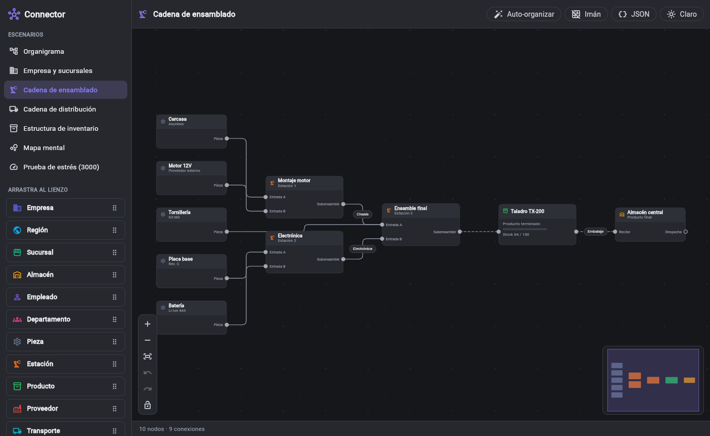
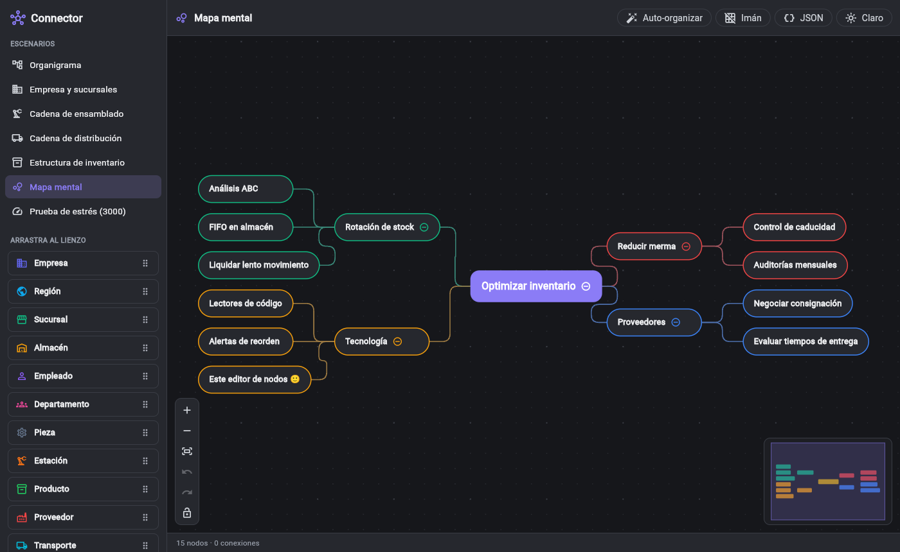
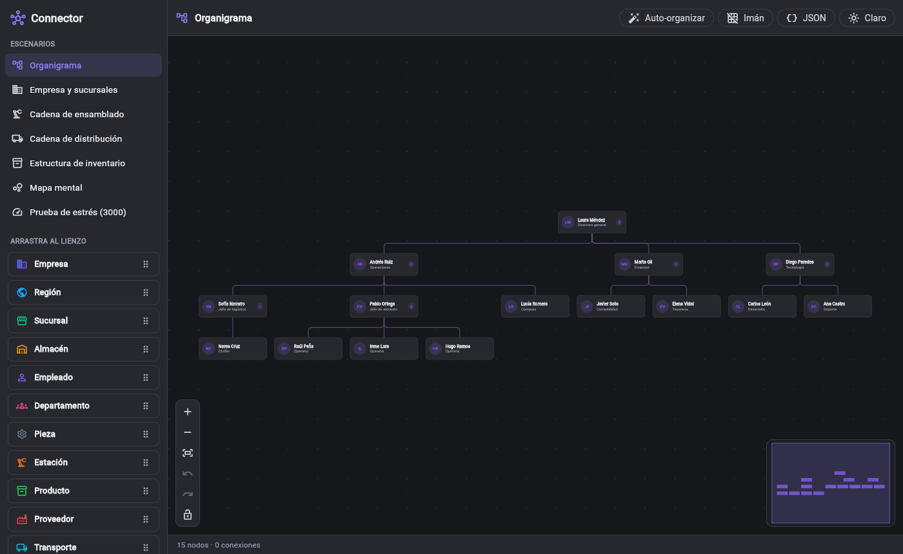
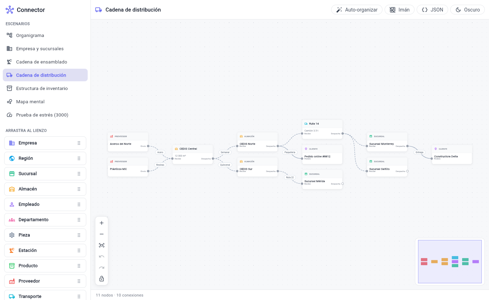

# connector

Editor de nodos de alto rendimiento para Flutter, al estilo de los Blueprints
de Unreal. Sirve para crear, conectar, mover y jerarquizar nodos, y está pensado
para integrarse como **un widget más** dentro de una app de inventario:

- Organigramas (jerarquía entre empleados)
- Estructura de la empresa y sus sucursales
- Cadenas de ensamblado y de distribución
- Estructura del inventario (categorías → productos)
- Mapas mentales libres, sin ninguna estructura impuesta

Funciona en **web, Windows, macOS, Linux, Android e iOS**. No tiene
dependencias aparte de Flutter.

| Cadena de ensamblado | Mapa mental |
|---|---|
|  |  |
| **Organigrama** | **Distribución (tema claro)** |
|  |  |

## Características

| | |
|---|---|
| **Nodos** | Cualquier widget como cuerpo (`nodeBuilder`), tarjeta por defecto, tamaño fijo o `autoSize`, bloqueo, colores por tipo |
| **Formas y estilos** | Tarjeta, caja, píldora, círculo con icono, rombo y hexágono; rellenos o sólo líneas; borde sólido, discontinuo, punteado o sin borde; color e icono por nodo o por tipo, todo serializable a JSON |
| **Puertos** | Entrada/salida/ambos, en los 4 lados, con etiqueta, tipo lógico para validar compatibilidad y máximo de conexiones |
| **Conexiones** | Bézier, ortogonal redondeada, ortogonal, recta. Etiquetas, flechas, trazo discontinuo, flujo animado. Conexiones "flotantes" sin puertos |
| **Crear conectores** | Cada nodo muestra tiradores **+** en sus lados (al pasar el ratón o al seleccionarlo, también en táctil). Arrastra uno hasta otro nodo para crear un enlace de jerarquía padre → hijo o una conexión de cualquier estilo (curva, ortogonal, recta, discontinua, animada, con flecha, color, grosor, etiqueta), con o sin puertos |
| **Editar conexiones** | Conexiones y enlaces de jerarquía se seleccionan igual: resaltado al pasar el ratón, arrastrar un extremo para reconectar (o soltarlo en el vacío para desconectar), Alt + clic en un puerto para romper sus conexiones |
| **Trazado** | Arrastra cualquier línea para que pase por otro sitio (p. ej. para sacarla de debajo de un nodo). El punto de paso acompaña a los nodos al moverlos; llévala de vuelta a su sitio para enderezarla |
| **Guías de alineación** | Al arrastrar o redimensionar, los bordes y centros se alinean con los de los nodos visibles y se dibujan guías. Ctrl/⌘ lo desactiva mientras se mantiene |
| **Animaciones** | Opcionales y configurables: los nodos aparecen creciendo y desaparecen encogiéndose, se "levantan" con sombra al arrastrarlos y se asientan con un rebote al soltarlos, se deslizan al deshacer o auto-organizar, las ramas se recogen hacia su padre al plegarse, las líneas nuevas se dibujan y las borradas se desvanecen, y la cámara se desliza al ajustar la vista o hacer zoom |
| **Tamaño** | Redimensionar arrastrando los bordes (ratón) o las esquinas del nodo seleccionado (táctil), con tamaño mínimo e imán a la rejilla |
| **Jerarquía** | `parentId` con detección de ciclos, colapsar/expandir subárboles, arrastrar un padre mueve su subárbol, **Alt + soltar** sobre otro nodo para asignarle padre |
| **Interacción** | Todo se ve en tiempo real mientras arrastras. Pan, zoom con rueda, pinza y trackpad, selección múltiple (Shift/Ctrl, rectángulo con Shift+arrastrar), imán a la rejilla, cursores según lo que hay debajo |
| **Edición** | Deshacer/rehacer con transacciones, duplicar, borrar, atajos de teclado |
| **Auto-organización** | `TreeLayout`, `LayeredLayout` (tipo Sugiyama), `RadialLayout`, `MindMapLayout`, `GridLayout`, con animación opcional |
| **Tu interfaz** | El editor no construye menús, diálogos ni barras: te entrega qué hay bajo el clic derecho (`onContextMenu`), qué hay seleccionado y dónde (`selectionOverlayBuilder`) y las acciones que sabe hacer (`EditorAction`). Tú pones textos, iconos y estilo |
| **Extras** | Minimapa y controles de zoom opcionales, vista previa de nodos (`NodePreview`), serialización JSON, tema claro/oscuro totalmente personalizable |

## Instalación

```yaml
dependencies:
  connector:
    git:
      url: https://github.com/mytrashg80-ops/connector
```

## Uso rápido

```dart
import 'package:connector/connector.dart';

final controller = NodeEditorController<Producto>(
  nodes: [
    NodeData(
      id: 'almacen',
      type: 'warehouse',
      title: 'Almacén central',
      position: const Offset(0, 0),
      ports: const [NodePort.output(id: 'out', label: 'Despacha')],
    ),
    NodeData(
      id: 'sucursal',
      type: 'branch',
      title: 'Sucursal Norte',
      position: const Offset(320, 0),
      ports: const [NodePort.input(id: 'in', label: 'Recibe')],
    ),
  ],
);

controller.connect(
  sourceNodeId: 'almacen', sourcePortId: 'out',
  targetNodeId: 'sucursal', targetPortId: 'in',
  label: 'Semanal',
);

// En tu árbol de widgets (necesita un tamaño acotado):
NodeEditor<Producto>(
  controller: controller,
  theme: isDark ? NodeEditorTheme.dark() : NodeEditorTheme.light(),
  onNodeTap: (node) => abrirDetalle(node.data),
)
```

Hay una app de demostración completa en [`example/`](example/lib/main.dart)
(`cd example && flutter run -d chrome`) con 7 escenarios: organigrama, empresa y
sucursales, cadena de ensamblado, distribución, inventario, mapa mental y una
prueba de estrés con 3000 nodos.

## Modelo de datos

- **`NodeData<T>`**: inmutable. `id`, `position`, `size`, `type`, `title`,
  `subtitle`, `data` (tu objeto de negocio `T`), `ports`, `parentId`,
  `collapsed`, `locked`, `autoSize` y `color`.
- **`NodePort`**: `NodePort.input(...)`, `NodePort.output(...)` o `NodePort(direction: PortDirection.both)`.
  Usa `type` para impedir conexiones incompatibles y `maxConnections` para limitarlas.
- **`EdgeData`**: conexión dirigida entre nodos/puertos con `label`, `curve`,
  `color`, `width`, `dashed`, `animated`, `arrow` y `metadata`.

## Controlador

```dart
// Grafo
controller.addNode(nodo);
controller.updateNode(id, (n) => n.copyWith(title: 'Nuevo'));
controller.moveNodes(ids, const Offset(10, 0), includeDescendants: true);
controller.removeNodes(ids, withDescendants: false);
controller.connect(...);              // valida; devuelve null si no es válida
controller.checkConnection(...);      // motivo del rechazo
controller.connectionValidator = (r) => r.target.type == 'customer' ? null : 'Sólo clientes';
controller.reconnectEdge(edgeId, moveSource: false, nodeId: 'otro', portId: 'in');
controller.setNodeRect(id, const Rect.fromLTWH(0, 0, 240, 120)); // posición + tamaño
controller.setEdgeBend(edgeId, const Offset(0, 80)); // punto de paso (null = automático)

// Jerarquía
controller.setParent('empleado', 'jefe');   // false si crearía un ciclo
controller.moveLinkToChild('empleado', 'otro'); // el enlace pasa a otro hijo
controller.setLinkBend('empleado', const Offset(-60, 0)); // trazado del enlace
controller.childrenOf(id); controller.descendantsOf(id); controller.ancestorsOf(id);
controller.toggleCollapsed(id);

// Selección, cámara e historial
controller.selectNodes(ids); controller.selectedNodeIds;
controller.selectLinks(['empleado']); controller.selectedLinkIds; // enlaces padre → hijo
controller.fitView(); controller.centerOnNode(id); controller.viewport.zoomBy(1.2);
controller.transaction(() { /* varias operaciones = un paso de deshacer */ });
controller.beginHistoryGroup(); /* gesto largo: notifica al momento */ controller.endHistoryGroup();
controller.undo(); controller.redo();

// Auto-organización (animada si pasas vsync)
await controller.applyLayout(const TreeLayout(), vsync: this, fitAfter: true);

// Persistencia
final json = controller.toJson(encodeData: (p) => p?.toJson());
controller.loadJson(json, decodeData: (raw) => Producto.fromJson(raw as Map));
```

El controlador es un `ChangeNotifier`, y además expone notificadores de grano
fino: `geometry`, `structure`, `edgesSignal`, `selection` y `history`. Escucha
sólo el que necesites; por ejemplo, una barra de estado que escuche
`structure` no se reconstruye mientras arrastras nodos.

## Formas, colores e iconos

Cada nodo puede tener su propio aspecto con `NodeData.style` (y su color con
`NodeData.color`); lo que no indique lo toma de su tipo (`NodeTypeStyle`) y
después del tema.

```dart
NodeData(
  id: 'hito',
  position: Offset.zero,
  size: const Size(88, 112),      // más alto que ancho: título bajo el círculo
  title: 'Entrega',
  color: Colors.teal,             // acento: icono y borde de "sólo líneas"
  style: const NodeStyle(
    shape: NodeShape.circle,      // card, box, pill, circle, diamond, hexagon
    icon: 'flag',                 // clave de NodeEditorTheme.icons
    filled: false,                // sólo líneas
    borderStyle: NodeBorderStyle.dashed, // solid, dashed, dotted, none
    // fillColor, borderColor, borderWidth, textColor…
  ),
)

// O para todo un tipo:
NodeEditorTheme.light(nodeTypes: {
  'nota': NodeTypeStyle(
      icon: Icons.sticky_note_2_outlined,
      color: Colors.amber,
      shape: NodeShape.box,
      filled: false,
      borderStyle: NodeBorderStyle.dashed),
})
```

- Para cambiar el estilo desde la UI basta con `controller.updateNode(id,
  (n) => n.copyWith(style: ..., color: ...))`. Se puede deshacer y se guarda
  en el JSON. `clearStyle: true` / `clearColor: true` vuelven al del tipo.
  El ejemplo trae un diálogo completo (`example/lib/style_editor.dart`).
- Los iconos se guardan como texto (`'flag'`, `'truck'`, `'check'`…) para
  que el JSON sea portable. `NodeIcons.all` trae unos 40; añade los tuyos con
  `theme.copyWith(icons: {...NodeIcons.all, 'mio': Icons.abc})`.
- `theme.resolveNodeStyle(node)` da el aspecto final (útil en tu propio
  `nodeBuilder`), y `NodeShapePainter` pinta cualquier silueta con su relleno
  y borde.
- Las líneas se anclan a la silueta (en el círculo, al círculo y no al
  título), los puertos se colocan en su borde y la vista lejana (LOD) dibuja
  cada forma.

## Tu propia interfaz (menús, barras, diálogos)

El paquete sólo dibuja el lienzo: nodos, líneas y los tiradores para
editarlos. **Todo lo demás lo construye tu aplicación** con sus widgets y su
estilo: menús contextuales, barras de acciones, diálogos, controles de zoom,
paletas… El editor expone las herramientas para hacerlo.

### Menú contextual

`onContextMenu` se llama con el clic derecho (o la pulsación larga) y trae:

- `target`: qué hay debajo. Es una clase sellada: `NodeTarget`,
  `SelectionTarget` (varios nodos seleccionados), `EdgeTarget`, `LinkTarget`
  (enlace padre → hijo) o `CanvasTarget`.
- `globalPosition`, `localPosition` y `worldPosition`.
- `actions`: las `EditorAction` que el editor sabe ejecutar sobre ese
  destino (sólo las que tienen sentido en ese momento).

```dart
NodeEditor<Item>(
  controller: controller,
  onContextMenu: (d) async {
    final items = <PopupMenuEntry<VoidCallback>>[
      // Opciones de tu aplicación…
      if (d.target case NodeTarget(:final node))
        PopupMenuItem(value: () => editar(node), child: const Text('Editar')),
      if (d.target case CanvasTarget(:final worldPosition))
        PopupMenuItem(
            value: () => crearNodo(worldPosition),
            child: const Text('Nuevo nodo')),
      // …y las del editor, con tus textos.
      for (final a in d.actions)
        PopupMenuItem(
          value: a.call,
          enabled: a.enabled,
          child: Text(miTexto(a)), // según a.command / a.value / a.selected
        ),
    ];
    final p = d.globalPosition;
    final run = await showMenu(
        context: context,
        position: RelativeRect.fromLTRB(p.dx, p.dy, p.dx, p.dy),
        items: items);
    run?.call();
  },
)
```

Una `EditorAction` no tiene texto ni icono, sólo datos:

| Campo | Qué es |
|---|---|
| `command` | `EditorCommand`: `duplicate`, `delete`, `deleteWithDescendants`, `collapse`, `expand`, `detachFromParent`, `lock`, `unlock`, `bringToFront`, `resetStyle`, `focus`, `deleteEdge`, `straightenEdge`, `toggleEdgeAnimation`, `setEdgeCurve`, `reverseEdge`, `straightenLink`, `unlink`, `selectAll`, `clearSelection`, `fitView`, `undo`, `redo` |
| `value` | Dato extra (la `EdgeCurve` de `setEdgeCurve`) |
| `enabled` | `false` si ahora no se puede (editor bloqueado, nada que deshacer…) |
| `selected` | Estado actual (la curva actual, si la línea está animada…) |
| `destructive` | Borra datos (para pintarla en rojo o pedir confirmación) |
| `call()` | La ejecuta (un paso de deshacer) |

También puedes pedirlas en cualquier momento, p. ej. para una barra de
herramientas o atajos propios:

```dart
controller.actionsFor(NodeTarget(nodo));
controller.actionFor(EdgeTarget(linea), EditorCommand.setEdgeCurve,
    value: EdgeCurve.step)?.call();
controller.targetForNode(nodo); // NodeTarget o SelectionTarget
```

Los callbacks por tipo (`onNodeContextMenu`, `onEdgeContextMenu`,
`onLinkContextMenu`, `onCanvasContextMenu`) siguen existiendo; si das
`onContextMenu`, éste los sustituye.

### Barra de acciones de la selección

`selectionOverlayBuilder` construye un widget tuyo junto a lo seleccionado
(un nodo, varios, una conexión o un enlace). El editor lo coloca encima (o
debajo si no cabe), lo mueve con la cámara y lo oculta mientras se arrastra.
Recibe el mismo `target` y `actions`, y el `anchor` en pantalla. Devuelve
`null` para no mostrar nada.

```dart
selectionOverlayBuilder: (context, d) => switch (d.target) {
  NodeTarget(:final node) => MiBarra(children: [
      MiBoton(Icons.edit, () => editar(node)),
      for (final a in d.actions)
        if (a.command == EditorCommand.delete)
          MiBoton(Icons.delete, a.call),
    ]),
  _ => null,
},
```

### Controles, minimapa y diálogos

- El editor **no añade controles ni minimapa** por defecto. Haz los tuyos con
  `controller.viewport.zoomBy(1.2, animate: true)`, `controller.fitView()`,
  `undo`/`redo` (`controller.history` avisa de cambios) y
  `controller.locked`, y colócalos con `NodeEditor.overlays`.
  `NodeEditorMinimap` y `NodeEditorControls` siguen disponibles como piezas
  opcionales (`showMinimap` / `showControls` o en `overlays`).
- El botón × sobre la línea seleccionada ya no aparece por defecto
  (`showEdgeDeleteButton: true` lo recupera).
- Para un diálogo de estilo propio: las opciones son `NodeShape.values`,
  `NodeBorderStyle.values` y `theme.icons`. `NodePreview` pinta un nodo igual
  que en el editor, y `controller.setNodeStyle(ids, estilo, color:, resize:)`
  y `resetNodeStyle(ids)` lo aplican a varios nodos en un solo paso de
  deshacer. `NodeShapes.suggestedSize` propone un tamaño al cambiar de forma.
- Para la creación de nodos: `onCanvasDoubleTap`, `onConnectionDropped`,
  `NodeEditorState.globalToWorld` y `showDropPreview` (paletas arrastrables).

El ejemplo (`example/lib/editor_ui.dart`) construye así su menú, su barra
flotante y sus controles con Material 3.

## Nodos personalizados

```dart
NodeEditor<Empleado>(
  controller: controller,
  nodeBuilder: (context, node, state) {
    if (node.type != 'employee') return null; // null = tarjeta por defecto
    return MiTarjetaEmpleado(
      empleado: node.data!,
      seleccionado: state.selected,
      onColapsar: state.onToggleCollapsed,
    );
  },
)
```

- Los puertos se dibujan encima automáticamente (`NodeEditorConfig.showPorts`).
- `DefaultNodeBody(node:, state:, content:)` reutiliza la tarjeta por defecto
  y te deja añadir contenido propio (p. ej. una barra de stock).
- `NodeEditorScope.themeOf(context)` da acceso al tema dentro del nodo.
- El widget de cada nodo se cachea y **sólo se reconstruye cuando cambia su
  contenido o su estado** (selección, conexiones...). Moverlo no lo reconstruye.
  Por eso no conviene que tu `nodeBuilder` dependa de `node.position`.

## Tema (claro / oscuro / tus colores)

```dart
final temaOscuro = NodeEditorTheme.dark(
  accent: Colors.teal,
  nodeTypes: {
    'warehouse': NodeTypeStyle(label: 'Almacén', icon: Icons.warehouse, color: Colors.amber),
    'employee': NodeTypeStyle(label: 'Empleado', icon: Icons.person, color: Colors.purple),
  },
).copyWith(
  edgeCurve: EdgeCurve.smoothStep,
  gridStyle: GridStyle.lines,
  nodeRadius: 14,
);
```

- `NodeEditorTheme.light()`, `.dark()` y `.fromColorScheme(scheme)`.
- Unas 60 propiedades: fondo, rejilla, nodos, cabeceras, puertos,
  conexiones, etiquetas, enlaces de jerarquía, selección, minimapa y controles.
- También es un `ThemeExtension`: regístralo en tu `ThemeData` y el editor lo
  usará automáticamente. Si no pasas ninguno, el editor elige el claro o el
  oscuro según `Theme.of(context).brightness`.
- **Consejo de rendimiento:** crea los temas una sola vez (en un campo o en tu
  `ThemeData`), no dentro de `build`. El editor usa la identidad del tema para
  saber cuándo invalidar sus cachés.

## Configuración

`NodeEditorConfig` permite: `readOnly`, `showGrid`, `snapToGrid`,
`showMinimap`, `showControls`, `showEdgeDeleteButton` (los tres `false` por
defecto), `dragMovesDescendants`, `reparentMode`
(`none` / `withModifier` / `always`), `wheelBehavior` (`zoom` / `pan`),
`lodScale`, `labelMinScale`, `cullMargin`, `showHierarchyLinks`,
`hierarchyAxis`, `enableKeyboardShortcuts`, `marqueeOnEmptyDrag`,
`enableNodeResize`, `minNodeSize`, `enableEdgeEditing`,
`enableAlignmentGuides`, `alignmentSnapDistance`, `animations`,
`connectorHandles`, `newConnector`...

Callbacks del widget: `onContextMenu`, `selectionOverlayBuilder`,
`onNodeTap`, `onNodeDoubleTap`, `onNodeContextMenu`,
`onEdgeTap`, `onEdgeContextMenu`, `onCanvasTap`, `onCanvasContextMenu`,
`onConnect`, `onConnectionRejected`, `onConnectionDropped` (para crear un nodo
ya conectado al soltar una conexión en el vacío), `onNodesMoved`,
`onParentChanged`, `canReparent`, `onNodeResized`, `canResize`,
`onEdgeReconnected`, `onEdgeDisconnected`, `onLinkTap` y `onLinkContextMenu`.

Los enlaces de jerarquía (los que dibuja `parentId`) se editan igual que las
conexiones. Mover el extremo del padre cambia el padre del hijo; mover el del
hijo pasa el enlace a otro nodo (`moveLinkToChild`); soltarlo en el vacío o
pulsar Supr lo rompe. Cada cambio llega por `onParentChanged` (con
`parentId` `null` al romperlo) y respeta `canReparent`.

`AlignmentSnapper` (exportado) es el motor de las guías por si quieres usarlo
en tus propias herramientas.

### Crear conectores

Con `connectorHandles` (activado por defecto) el nodo bajo el ratón, o el
nodo seleccionado, muestra un tirador **+** en cada lado. Al arrastrarlo
hasta otro nodo se crea lo que diga `newConnector`:

```dart
NodeEditorConfig(
  // Enlace de jerarquía: el nodo de destino pasa a ser hijo del de origen.
  newConnector: ConnectorStyle.hierarchy,
  // O una conexión con el estilo que quieras:
  // newConnector: const ConnectorStyle(
  //   curve: EdgeCurve.smoothStep, dashed: true, arrow: true,
  //   color: Colors.teal, width: 2, animated: false, label: 'envío'),
)
```

* **Jerarquía:** se valida igual que el resto (sin ciclos, `canReparent`) y
  avisa por `onParentChanged`. Si no es válida, la línea se pone roja y
  `onConnectionRejected` recibe el motivo.
* **Conexión:** se puede soltar sobre el cuerpo de cualquier nodo (conexión
  flotante, sin puertos) o sobre un puerto. Las conexiones que se arrastran
  desde un puerto también usan el estilo de `newConnector` (si éste es de
  jerarquía, desde un puerto sale una conexión normal). Avisa por
  `onConnect`.
* **Soltar en el vacío:** llega a `onConnectionDropped`, cuyo
  `details.style` dice qué se estaba creando (p. ej. para crear un hijo o un
  nodo ya conectado).

Por código: `controller.connect(..., style: ConnectorStyle(...))` y
`controller.setParent(hijo, padre)`.

### Animaciones

Todas son opcionales. Se configuran con `NodeEditorConfig.animations`:

```dart
NodeEditor(
  controller: controller,
  config: NodeEditorConfig(
    // Todas activadas (por defecto):
    animations: const NodeEditorAnimations(),
    // Ninguna:
    // animations: NodeEditorAnimations.none,
    // A tu gusto:
    // animations: const NodeEditorAnimations(
    //   duration: Duration(milliseconds: 400),
    //   nodeExit: false,
    //   dragLift: false,
    // ),
  ),
)
```

| Opción | Qué anima |
|---|---|
| `enabled` | Interruptor general |
| `nodeEnter` | Nodos nuevos (crear, pegar, duplicar, deshacer un borrado): aparecen creciendo |
| `nodeExit` | Nodos borrados: se encogen y se desvanecen donde estaban |
| `dragLift`, `liftScale` | Al arrastrar, los nodos se levantan con sombra; al soltar se asientan con un pequeño rebote |
| `moveTransitions` | Cambios de posición fuera de un arrastre (deshacer/rehacer, auto-organizar, flechas, API): los nodos se deslizan |
| `collapse` | Plegar una rama la recoge hacia el padre; desplegarla la saca de él |
| `edgeEnter`, `edgeExit` | Las conexiones y enlaces nuevos se dibujan desde el origen; los borrados se desvanecen |
| `camera`, `cameraDuration` | Ajustar la vista y el zoom desde los botones o el teclado. Por API: `fitView(animate: true)`, `centerOnNode(id, animate: true)`, `viewport.zoomBy(f, animate: true)` o `viewport.animateTo(...)` |
| `duration`, `curve` | Duración y curva generales |
| `maxAnimatedNodes` | Si un cambio afecta a más nodos (cargar un documento entero), se aplica sin animar |
| `respectReduceMotion` | Si el sistema pide reducir el movimiento, se desactivan solas |

Son sólo visuales: el controlador, el historial, el JSON y los callbacks
cambian al instante, igual que sin animaciones, así que tu lógica no tiene que
esperar a nada.

Para soltar elementos desde tu propia paleta usa un `DragTarget` y
`GlobalKey<NodeEditorState<T>>().currentState!.globalToWorld(offset)`. Con
`showDropPreview(rect)` en `onMove` el editor dibuja la silueta del nodo donde
caerá (y `showDropPreview(null)` en `onLeave` / al soltar). Hay un ejemplo
completo en `example/lib/main.dart`.

### Atajos

| Acción | Atajo |
|---|---|
| Zoom | Rueda, pinza, trackpad, `+` / `-` |
| Desplazar | Arrastrar el fondo, botón central, dos dedos |
| Selección múltiple | Shift/Ctrl + clic, Shift + arrastrar (rectángulo), Ctrl+A |
| Conectar | Arrastrar desde un puerto de salida |
| Mover una conexión | Arrastrar su extremo (si está seleccionada o bajo el ratón), arrastrar desde una entrada ya conectada, o Ctrl/⌘ + arrastrar desde cualquier puerto |
| Desconectar | Soltar el extremo en el vacío, botón × de la conexión seleccionada, Supr, o Alt + clic en el puerto |
| Cambiar el trazado de una línea | Arrastrarla por el medio (en táctil, primero seleccionarla); llevarla de vuelta a su sitio la endereza |
| Redimensionar | Arrastrar un borde o una esquina del nodo |
| Alinear | Automático al arrastrar o redimensionar; mantener Ctrl/⌘ para soltar libremente |
| Asignar padre | Mantener **Alt** al soltar un nodo sobre otro |
| Menú contextual | Clic derecho o pulsación larga |
| Eliminar | Supr / Retroceso |
| Deshacer / Rehacer | Ctrl/⌘+Z · Ctrl/⌘+Shift+Z · Ctrl+Y |
| Duplicar | Ctrl/⌘+D |
| Ajustar vista | F |
| Mover selección | Flechas (Shift = paso de rejilla) |

## Rendimiento

El editor está pensado para convivir con el resto de tu app sin acaparar
recursos:

1. **Culling con índice espacial.** Una rejilla hash (`SpatialIndex`) responde
   en O(celdas) qué nodos están cerca del viewport. Sólo esos nodos existen
   como widgets, aunque el grafo tenga miles.
2. **La cámara es una transformación de capa.** Al desplazar o hacer zoom no se
   reconstruye ni se vuelve a medir ningún widget: cada nodo es un
   `RepaintBoundary` y sólo se recompone la escena.
3. **Mover nodos sólo recoloca.** Arrastrar dispara un relayout que no vuelve a
   medir a los hijos (sus restricciones no cambian) y no reconstruye widgets.
4. **Conexiones en una capa cacheada.** Las líneas se pintan en una capa propia
   que sólo se repinta cuando cambia el grafo o la cámara sale de la región
   precalculada. La geometría de cada conexión se cachea y sólo se recalcula si
   se mueve alguno de sus extremos.
5. **Nivel de detalle (LOD).** Por debajo de `lodScale` los nodos se pintan como
   rectángulos simples, sin widgets. En la prueba de 3000 nodos, la vista
   general no construye ningún widget de nodo.
6. **Notificaciones de grano fino.** Cada capa escucha sólo lo que necesita, y la
   barra de estado o el minimapa no se recalculan al mover la cámara.
7. **Sin trabajo en reposo.** No hay timers ni tickers activos salvo que existan
   conexiones `animated: true`. El minimapa graba los nodos en una `Picture`
   que reutiliza mientras el grafo no cambie.
8. **Ayudas de edición en su propia capa.** El resaltado, los tiradores y el
   tamaño al redimensionar se pintan en una capa aparte, que sólo dibuja algo
   cuando hay una conexión bajo el ratón o algo seleccionado. Los gestos
   largos (arrastrar, redimensionar) agrupan el historial sin retener las
   notificaciones, así que se ven en tiempo real y siguen siendo un único paso
   de deshacer.
9. **Guías de alineación baratas.** Al empezar el gesto se toman una vez los
   rectángulos de los nodos visibles; cada movimiento compara sólo con ellos
   (unas pocas comparaciones por nodo) y no reconstruye nada: las guías se
   pintan en la capa de ayudas. Doblar una línea tampoco reconstruye el
   editor, sólo repinta la capa de conexiones.
10. **Animaciones sin reconstruir.** Un único ticker mueve todas las
    animaciones y se detiene en cuanto terminan. No reconstruyen widgets: cada
    nodo animado sólo cambia su capa (opacidad, escala, posición) y la escena
    de conexiones se repinta. Sólo se animan los nodos que se ven, con un
    límite (`maxAnimatedNodes`) para que cargar un documento grande no cueste
    nada. Con `NodeEditorAnimations.none` ni siquiera se añade la capa por
    nodo.

## Tests

```bash
flutter test
```

Cubren el modelo, la validación de conexiones, la jerarquía, el historial, la
serialización, el índice espacial, los layouts y la interacción del widget
(arrastrar, desplazar, conectar, LOD, cambio de tema y culling con 5000 nodos).
